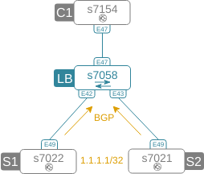

# Resilient ECMP plus
Improving resilient ECMP with directflow connection tracking

## Problem statement
Resilient ECMP has one major disadvantage that makes it difficult for it to be used for client-facing services. When new nexthops are being added or removed, resilient ECMP tables gets populated with those entries immediately, which results in reset of all existing TCP connections going to these new/removed nexthops. This repo contains the setup instructions and code required to build the proof-of-concept demo showing how directflow can be used to do (NAT-like) connection tracking to ensure existing TCP sessions "stick" to their old nexthops even when new ones are being added or removed. This can be used to gradually drain existing servers to take them down for maintenance or introduce new servers to horizontally scale the capacity. 

## Demo setup

### 1. Build the physical topology

Based on the following diagram:




### 3. Setup the server-side
Two servers S1 and S2 will be running a simple web server and [gocast](https://github.com/mayuresh82/gocast) to advertise /32 to load-balancing switch over BGP. Repeat the following steps on both S1 and S2:

```bash
bash
sudo systemctl start docker

docker run -d -p 80:80 --name $(hostname) --hostname $(hostname) containous/whoami

mkdir gocast
cat << EOF >> gocast/gocast.yaml
agent:
  # http server listen addr
  listen_addr: :8181
  # Interval for health check
  monitor_interval: 10s
  # Time to flush out inactive apps
  cleanup_timer: 15m

bgp:
  local_as: 65100
  remote_as: 65000
  # override the peer IP to use instead of auto discovering
  peer_ip: 5.5.5.5
  communities:
    - 65100:100
  origin: igp
EOF

docker run -d --name bgp --cap-add=NET_ADMIN --net=host -v $(pwd)/gocast/:/conf mayuresh82/gocast -v 9 --config=/conf/gocast.yaml
```

### 4. Install df-agent
DF-agent is the process responsible for directflow rule provisioning on LB. It can be installed anywhere and the only requirement is for it to be reachable from the LB switch's default vrf. In this case it'll be installed on both S1 and S2 and reachable on the IP advertised by gocast. This needs to be done on S1 and S2.

```
docker run -d --name df-agent --cap-add=NET_ADMIN --net=host networkop/df-agent
```

### 5. Enable BGP anycast
Finally, we can tell gocast to advertise the 1.1.1.1/32 towards LB. This needs to be done on S1 and S2.

```
curl "http://127.0.0.1:8181/register?name=traefik&vip=1.1.1.1/32&monitor=port:tcp:80"
```

Expected output on s7058 (LB) is as follows:

```
s7058#sh ip bgp 1.1.1.1/32
BGP routing table information for VRF default
Router identifier 5.5.5.5, local AS number 65000
BGP routing table entry for 1.1.1.1/32
 Paths: 2 available
  65100
    23.23.23.3 from 23.23.23.3 (23.23.23.3)
      Origin IGP, metric 0, localpref 100, IGP metric 1, weight 0, received 00:01:07 ago, valid, external, ECMP head, ECMP, best, ECMP contributor
      Community: 65100:100
      Rx SAFI: Unicast
  65100
    34.34.34.4 from 34.34.34.4 (34.34.34.4)
      Origin IGP, metric 0, localpref 100, IGP metric 1, weight 0, received 00:00:12 ago, valid, external, ECMP, ECMP contributor
      Community: 65100:100
      Rx SAFI: Unicast
```

## Problem demonstration

The following sequence of steps will reproduce the default (undesired) behaviour of resilient ECMP

### 1. Identify two flows that take different ECMP paths

These steps need to be done from the LB. Port numbers may be different as long as they produce two different output interfaces:

```text
s7058#show load-balance destination ip ingress-interface Et47 src-ipv4-address 12.12.12.1 dst-ipv4-address 1.1.1.1 ip-protocol 6 src-l4-port 30002 dst-l4-port 80
Output Interface: Ethernet43
s7058#show load-balance destination ip ingress-interface Et47 src-ipv4-address 12.12.12.1 dst-ipv4-address 1.1.1.1 ip-protocol 6 src-l4-port 30001 dst-l4-port 80
Output Interface: Ethernet42
```


### 2. Establish TCP session to S1

s7154 will play the role of a client

```
s7154#bash nc -v -p 30002  1.1.1.1 80
Ncat: Version 6.40 ( http://nmap.org/ncat )
Ncat: Connected to 1.1.1.1:80.
```

### 3. Simulate the failure of S1

Stop advertising the anycast IP from S1:

```bash
[admin@s7022 ~]$ curl "http://127.0.0.1:8181/unregister?name=traefik&vip=1.1.1.1/32&monitor=port:tcp:80"
```

From C1's open netcat session, request the home http page:

```
GET / HTTP/1.0
Host: localhostNcat: Connection reset by peer.
% 'nc -v -p 30002 1.1.1.1 80' returned error code: 1
```

When S1 fails, all existing flows will get redirected to S2 and will get TCP RST immediately.


### 4. Open a new netcat session

The new session will land on s7021 (S2) this time (since it's the only server left)

```
s7154#bash nc -v -p 30002  1.1.1.1 80
Ncat: Version 6.40 ( http://nmap.org/ncat )
Ncat: Connected to 1.1.1.1:80.
```

### 5. Simulate S1 recovery

Start advertising the anycast IP again:

```bash
[admin@s7022 ~]$ curl "http://127.0.0.1:8181/register?name=traefik&vip=1.1.1.1/32&monitor=port:tcp:80"
```

From C1's open netcat session, request home http page:

```
GET / HTTP/1.0
Host: localhostNcat: Connection reset by peer.
% 'nc -v -p 30002 1.1.1.1 80' returned error code: 1
```

When new server gets added to the ECMP nexthop group, part of the existing sessions will get redirected to it, which will result in an immediate TCP RST from the server.


This happens since S1 doesn't know anything about the TCP session state to S2, which still thinks the session is established:

```
[admin@s7021 ~]$ netstat -an | grep 1.1.1.1
tcp6       0      0 1.1.1.1:80              12.12.12.1:30002        ESTABLISHED
```

## Problem solution demonstration

To enable DF-agent to action on all incoming TCP sessions, we need to redirect them to DF-agent's anycast IP. Do the following from LB:

```
s7058(config)#monitor session TCP-SYN destination tunnel mode gre source 5.5.5.5 destination 1.1.1.1 
s7058(config)#monitor session TCP-SYN source Ethernet47 rx ip access-group ACL-TCP-SYN
```


First, let's see how DF connection tracking will allow servers to be taken out of service gracefully. 

### 1. Establish a TCP session to S1

```
s7154#bash nc -v -p 30002  1.1.1.1 80
Ncat: Version 6.40 ( http://nmap.org/ncat )
Ncat: Connected to 1.1.1.1:80.
```

### 2. Gracefully shutdown S1

Instead of withdrawing, we'll set local-preference of anycast route received from S1 to 1:

```text
s7058#sh run sec PL|RMAP
ip prefix-list PL-S1-NEXTHOP seq 10 permit 34.34.34.4/32
!
route-map RMAP-TRAEFIK-IN permit 10
   match ip next-hop prefix-list PL-S1-NEXTHOP
   set local-preference 1
!
router bgp 65000
   neighbor TRAEFIK route-map RMAP-TRAEFIK-IN in
```

This should result in only S2 being selected as the best path:

```text
s7058#sh ip bgp 1.1.1.1
BGP routing table information for VRF default
Router identifier 5.5.5.5, local AS number 65000
BGP routing table entry for 1.1.1.1/32
 Paths: 2 available
  65100
    23.23.23.3 from 23.23.23.3 (23.23.23.3)
      Origin IGP, metric 0, localpref 100, IGP metric 1, weight 0, received 00:11:41 ago, valid, external, best
      Community: 65100:100
      Rx SAFI: Unicast
  65100
    34.34.34.4 from 34.34.34.4 (34.34.34.4)
      Origin IGP, metric 0, localpref 1, IGP metric 1, weight 0, received 00:03:13 ago, valid, external
      Community: 65100:100
      Rx SAFI: Unicast
```

From C1's open netcat session, request home http page:

```
GET / HTTP/1.0

HTTP/1.0 200 OK
Date: Mon, 01 Apr 2019 15:02:34 GMT
Content-Length: 122
Content-Type: text/plain; charset=utf-8

Hostname: s7022
IP: 127.0.0.1
IP: 172.17.0.2
GET / HTTP/1.1
Host: 
User-Agent: Go-http-client/1.1

```

The original flow is still pinned by directflow to its old ECMP nexthop

```
s7058(config-router-bgp)#show directflow flows
Flow 12_12_12_1-30002-1_1_1_1-80:
  persistent: False
  priority: 0
  priorityGroupType: default
  tableType: ifp
  hard timeout: 0
  idle timeout: 300
  match:
    Ethernet type: IPv4
    source IPv4 address: 12.12.12.1/255.255.255.255
    destination IPv4 address: 1.1.1.1/255.255.255.255
    IPv4 protocol: TCP
    source TCP/UDP port or ICMP type: 30002
    destination TCP/UDP port or ICMP type: 80
  actions:
    output nexthop: 34.34.34.4
  source: config
  matched: 5 packets, 367 bytes
```

### 3. Establish a new TCP session to S1

300 seconds later, the DF flow should expire and we can simulate another HTTP session which will land on S2 this time

```
s7154#bash nc -v -p 30002  1.1.1.1 80
Ncat: Version 6.40 ( http://nmap.org/ncat )
Ncat: Connected to 1.1.1.1:80.
```

### 3. Gracefully recover S1

Remove the route-map to restore the ECMP group.

```
s7058(config-router-bgp)#no neighbor TRAEFIK route-map RMAP-TRAEFIK-IN in

```


From C1's open netcat session, request home http page:

```
GET / HTTP/1.0

HTTP/1.0 200 OK
Date: Mon, 01 Apr 2019 15:14:27 GMT
Content-Length: 122
Content-Type: text/plain; charset=utf-8

Hostname: s7021
IP: 127.0.0.1
IP: 172.17.0.2
GET / HTTP/1.1
Host: 
User-Agent: Go-http-client/1.1
Connection: close
```

The session is still pinned to S2 by a non-persistent directflow:


```
s7058(config-router-bgp)#show directflow flows
Flow 12_12_12_1-30002-1_1_1_1-80:
  persistent: False
  priority: 0
  priorityGroupType: default
  tableType: ifp
  hard timeout: 0
  idle timeout: 300
  match:
    Ethernet type: IPv4
    source IPv4 address: 12.12.12.1/255.255.255.255
    destination IPv4 address: 1.1.1.1/255.255.255.255
    IPv4 protocol: TCP
    source TCP/UDP port or ICMP type: 30002
    destination TCP/UDP port or ICMP type: 80
  actions:
    output nexthop: 23.23.23.3
  source: config
  matched: 7 packets, 509 bytes
```


## Notes

the DF agent code is not thoroughly tested. It can be run directly as a python script or as a docker container which can be built with `./build.sh`

All startup configs have be anonymized with [netconan](https://pypi.org/project/netconan/).